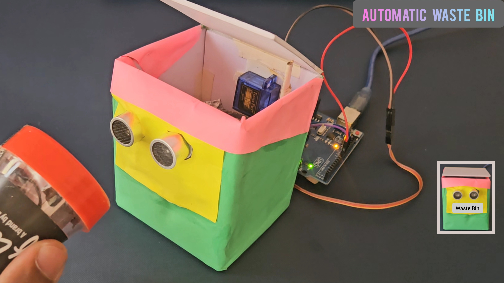

# Automatic Touchless Waste Bin using Arduino

## Project Description
This project demonstrates a simple automatic waste bin using Arduino UNO, Ultrasonic Sensor (HC-SR04), and Servo Motor.

The ultrasonic sensor detects a hand placed near the bin. If the distance is less than or equal to 20 cm, the servo motor rotates. Otherwise, it stays in the default position.

---

## Components Used
- Arduino UNO
- Ultrasonic Sensor (HC-SR04)
- Servo Motor
- Jumper Wires
- Cardboard Structure

---

## Pin Connections

Ultrasonic Sensor:
- VCC → 5V
- GND → GND
- TRIG → Pin 9
- ECHO → Pin 10

Servo Motor:
- VCC → 5V
- GND → GND
- Signal → Pin 8

---

## Arduino Code

The complete Arduino code is available here:

[automatic_waste_bin.ino](./automatic_waste_bin.ino)

---

## Skills Used
- Embedded Systems
- Arduino Programming
- Sensor Interfacing
- Servo Motor Control

- Basic Automation

##  Demo Video

